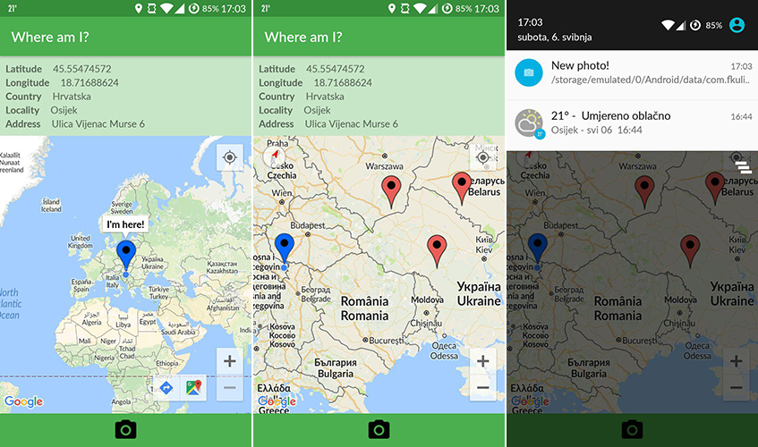

Where am I?
=================================
Faculty of Electrical Engineering, Computer Science and Information Technology Osijek  
Mobile platform application development  
Fifth Homework

## Requirements

* Create Activity with map fragment
* Add markers
* Play sound when marker is added
* Implement Camera API
* Generate signed APK

## Screenshots

## Resources

* [Taking Photos Simply](https://developer.android.com/training/camera/photobasics.html)
* [Vogella CameraAPI tutorial](http://www.vogella.com/tutorials/AndroidCamera/article.html)
* [FileProvider documentation](https://developer.android.com/reference/android/support/v4/content/FileProvider.html)
* [PendingIntent documentation](https://developer.android.com/reference/android/app/PendingIntent.html)
* [Icons](https://material.io/icons/)
* [Sound files](http://soundbible.com/)
